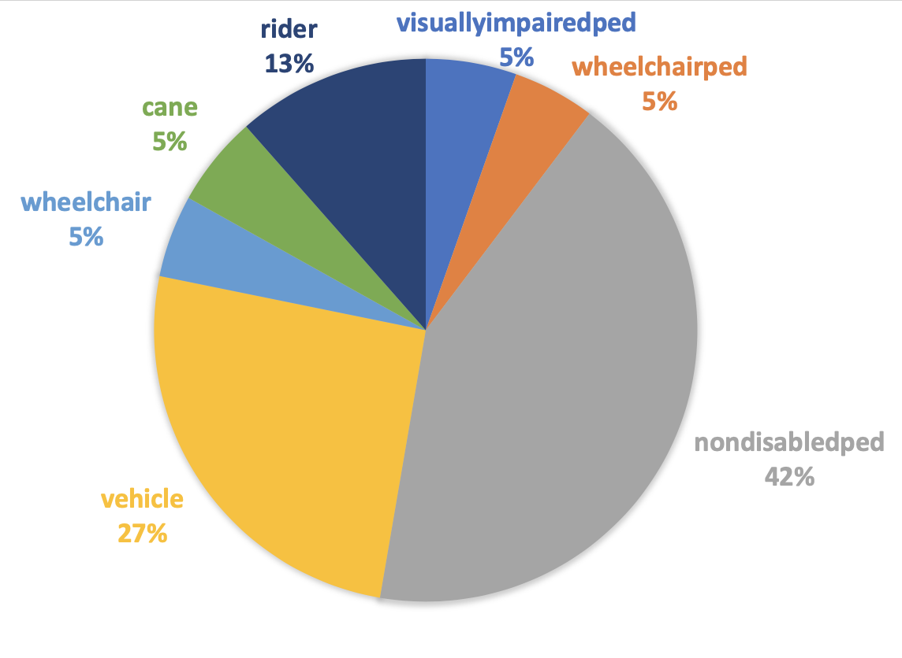

# 3D Mesh Reconstruction Dataset

We collect data across four towns, 14 settings with various weather conditions and times of day in a recent proposed Xworld environment (Zhang et al., [2021](https://openaccess.thecvf.com/content/ICCV2021/papers/Zhang_X-World_Accessibility_Vision_and_Autonomy_Meet_ICCV_2021_paper.pdf)). In each town, we spawn 150 vehicles and 300 pedestrians 20% of which are disabled pedetrians. The dataset consists of 3752 training images and 3790 testing images containing 4186 visually impaired pedestrians and canes, 3788 wheelchaired pedestrians and wheelchairs, 32746 nondisabled pedestrians, 19697 vehicles, and 8848 riders. The class statistics are shown in below


## About Data collection methodology

This description gives a detailed process on how the data was collected. It should describe the conditions under which the data was recorded and also the devices used to record the data.

### Description of the data

Here you can descibe how the data is organized in this whole dataset. How the data is stored in all the files. You also have to brief about the naming convention of the files in different directories. 

```
Give examples
Root Dir/
  -Sub Dir/
    -DataFile1
    -DataFile2
    -...
  -Sub Dir/
    -Dir/
      -DataFile1
      -DataFile2
      -...
  -README.md

```

### And file formats

If the data includes images or audio, you can mention the file format eg.(.svg, .png, .mpeg).
```
-500 images, format svg.
```

## Online Repository link

* [DataRepository](https://www.kaggle.com/datasets) - Link to the data repository.

## Authors

* **authorname** - *Initial work* - [shashvatshah9](https://github.com/shashvatshah9)

See also the list of [contributors](https://github.com/your/project/contributors) who participated in this project.

## License

This project is licensed under the MIT License - see the [LICENSE.md](LICENSE.md) file for details

## Acknowledgments

* Hat tip to anyone whose code was used
* Inspiration
* etc
